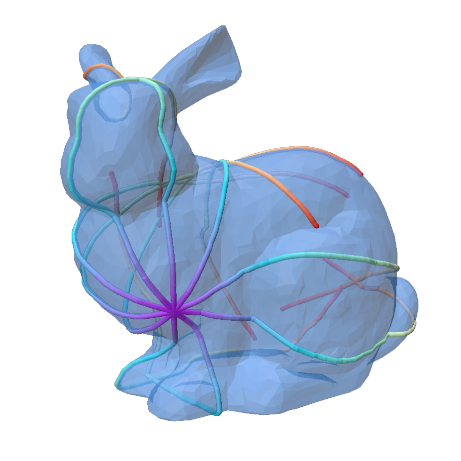

# DiGeo

[](https://badge.fury.io/py/digeo)
[](https://pypi.org/project/digeo/)
[](https://opensource.org/licenses/BSD-3-Clause)
[](https://github.com/circle-group/digeo/actions/workflows/tests.yml)
[](https://github.com/astral-sh/ruff)

**DiGeo** (Differentiable Geometry) is a Python package designed to trace differentiable geodesics (compute the exponential map) on triangulated meshes.

Implemented with PyTorch and custom CUDA kernels, DiGeo is built for efficiency and scalability. It supports batched inputs, single and double-precision floating-point numbers, and seamless execution on both CPU and GPU.

<p align="center">
    
    <!-- TODO: change this to url -->
</p>


## Key Features

* **Fast Geodesic Tracing:** Highly optimized C++ and CUDA kernels for tracing straightest geodesics on meshes.
* **Differentiable:** Compute gradients with respect to start points and directions.
* **Batched Operations:** Process multiple meshes and points simultaneously using `MeshBatch` and `MeshPointBatch`.
* **Mesh Optimization:** Built-in Riemannian optimization algorithms including Gradient Descent (`mesh_gd`) and L-BFGS (`mesh_lbfgs`).
* **Geometric Deep Learning:** Includes neural network modules like the Adaptive Geodesic Convolutional Layer (`AGC`) and Biharmonic Distance.


## Installation

### Dependencies

Before installing `DiGeo`, ensure you have a compatible python version, the necessary libraries will be installed automatically via pip:

* **Python:** $\ge$ 3.10
* **Libraries:** `Pytorch`, `NumPy`, `tqdm`, `SciPy`, `Trimesh`, `Robust Laplacian`

### Standard Installation (via pip)

The easiest way to install the latest stable release is through PyPI. The wheels are precompiled using Pytorch 2.10 and CUDA 12.8.

```bash
pip install torch==2.10 --index-url https://download.pytorch.org/whl/cu128
pip install digeo
```

> **Compatibility Note:** If you are using another version of PyTorch or CUDA, you will need to build from source to ensure binary compatibility.


### Platform & Hardware Support

`DiGeo` utilizes custom CUDA kernels. Please note the following hardware limitations for the `pip` installation:

* **Linux (x86_64) and Windows (ARM64):** Includes pre-compiled CUDA kernels.
* **Linux (ARM64) and macOS:** `pip` will default to a **CPU-only** version. For GPU support, you will need to build the package from source.
* **For other platforms or architectures:** You must build the package from source.


### Install from Source

**Requirements:** A working **C++ compiler** and the **NVIDIA CUDA Toolkit**.

To install version x.y.z of DiGeo from source:
```bash
pip install --no-build-isolation -e "digeo @ git+ssh://git@github.com/circle-group/DiGeo.git@x.y.z"
```


## License

This project is licensed under the BSD 3-Clause License. See the [LICENSE](LICENSE) file for details.

